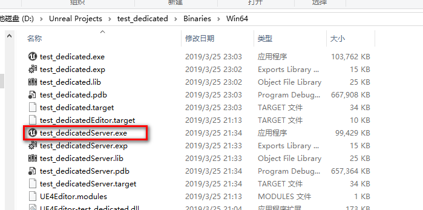
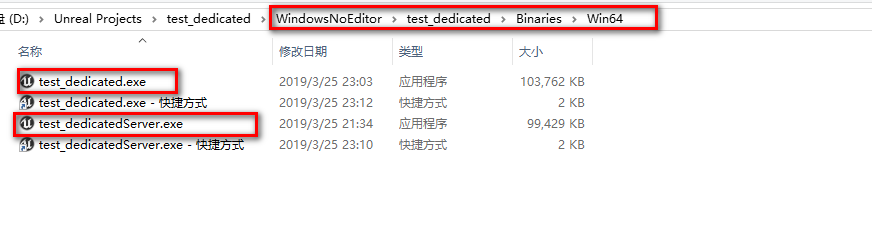

### 准备

1. 下载UE4源码：
2. 在源码目录，执行Setup.bat -include=Linux
3. 执行GenerateProjectFiles.bat
4. 打开UE4.sln，编译“Development Editor"
5. 跳转到此工程目录（test_dedicated），在Source中，新建文件test_dedicatedServer.Target.cs，内容抄袭下[官方wiki](https://wiki.unrealengine.com/Dedicated_Server_Guide_(Windows_%26_Linux))上的
6. 用源码编译后的UE4Editor.exe打开此工程，并且生成sln文件：test_dedicated.sln

### Windows版本

1. 打开test_dedicated.sln，选择 “Development Server, Win64”，然后编译，成功后，将在Binaries\Win64看到test_dedicatedServer.exe 
2. 正常打一个win64的版本，然后将test_dedicatedServer.exe拷贝到WindowsNoEditor\test_dedicated\Binaries\Win64中。
3. 启动服务器：test_dedicatedServer.exe -log
4. 启动客户端：test_dedicated.exe -windowed -resx=600 -resy=400

### Linux版本

1. 参考[官方wiki](https://wiki.unrealengine.com/Compiling_For_Linux)下载[clang工具](http://cdn.unrealengine.com/CrossToolchain_Linux/v12_clang-6.0.1-centos7.zip)，并设置环境变量LINUX_MULTIARCH_ROOT

2. 打开test_dedicated.sln，选择“Development Server, Linux”，然后编译，成功后，将在Binaries\Linux看到test_dedicatedServer

3. 打开工程，文件->打包版本->linux，打一个linux版本的包（默认是LinuxNoEditor文件夹）

4. 将Binaries\Linux\test_dedicatedServer拷贝到LinuxNoEditor\test_dedicated\Binaries\Linux\中

5. 由于默认的UE4不允许以root权限启动，需要创建一个普通用户。假定linux上有一个普通用户，名为liubo，那么将LinuxNoEditor文件夹传输到/usr/liubo文件夹中。依次执行：

   - cd /usr/liubo/LinuxNoEditor
   - chown -R liubo *
   - chmod 777 test_dedicated/Binaries/Linux/test_dedicatedServer

6. 最后跳转到test_dedicated/Binaries/Linux/目录，执行test_dedicatedServer -log即可。

